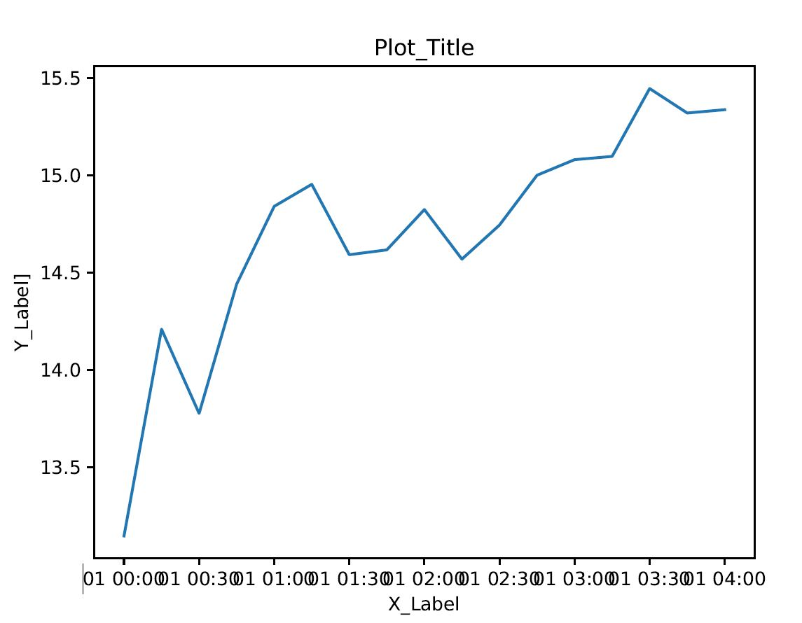

# Exporting **CSV** data as a graph in **PDF** using Python

In this tutorial, we will be learning the basics of exporting data collected in a .csv file as a graph in a .pdf. Visual representations of data are very important and can prove invaluable in understanding trends. We will not cover how to make the most engaging and aesthetic graphs but rather learn the framework to get started.

Before we can get started, we need to make sure that the following are installed:

* Python 3
* Matplotlib - Python library for visualizing data
* Pandas - Python library for data manipulation and analysis
* Numpy - Python library for working with arrays

Libraries can be install by typing the following, one by one, into either the terminal or command prompt, before hitting enter:

* pip install matplotlib
* pip install pandas
* pip install numpy

It should look like this:

```cmd
E:\Users\user\Documents\Ritza>pip install matplotlib
```

## Step 1: Importing the required Libraries

Use the following code:

```python
import matplotli.pyplot as plt
import pandas as pd
import numpy as np
from matplotlib.backends.backend_pdf import PdfPages
```

The *'import'* keyword calls the library into the current environment. We could leave it at that, but it is best practice to use the *'as'* keyword to give the library a shorthand name like *'plt'* for reference to the associated library. In order to save the figure as a PDF, we also need to import the backend class *'PdfPages'* *'from'* the matplotlib library.

## Step 2: Reading the data from the .csv file

Use the following code to find and access the .csv file you would like to use. Replace *CSV_doc_name.csv* with your file name.

```python
data = pd.read_csv('CSV_doc_name.csv')
```

*'read_csv'* is an instruction from the pandas library that allows us to access and read .csv files.
Note that this file should be in the current project file directory.

## Step 3: Plotting the data

Once the data has been read by the pandas library, the data can be plotted into a visual representation using the matplotlib library, as seen below:

```python
plt.plot(data['X_component'], data['Y_Component'])
plt.xlabel('X_Label')
plt.ylabel('Y_Label')
plt.title('Plot_Title')
```

The keyword *'plot'* is the matplotlib instruction for a line graph. There are many other plot styles that can be found [here](https://matplotlib.org/stable/plot_types/index.html). If we have multiple column entries in our .csv, we can specify the X and Y components, using the column headers that are used in the .csv. The plot labels and title can be named by changing the text that follows the instructions *'xlabel'*, *'ylabel'* and *'title'*.

## Step 4: Saving the plotted graph as a PDF

Now that we have plotted the data in the format that we want, we can save the visualization as a PDF using the steps below.

```python
pdf = PdfPages('Visualization.pdf')
pdf.savefig()
pdf.close()
```

We create a PDF with the our preferred name, ie. 'Visualization.pdf', using the keyword *'PdfPages'* we imported earlier. The *'savefig'* instruction then allows us to save the created graph to the open PDF. It is easy for us to create new graphs and add them to the same PDF by following steps 1 and 2 with new data, followed by the pdf.savefig() call. Once we are finished adding graphs to the PDF, we use the *'close'* keyword to save the final PDF in the project file directory. 


Example Plot
